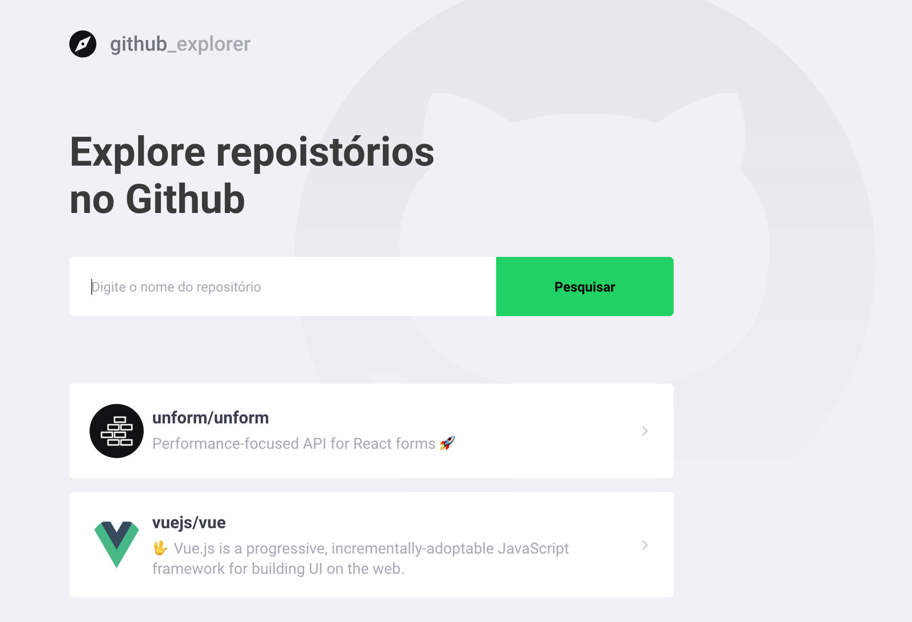
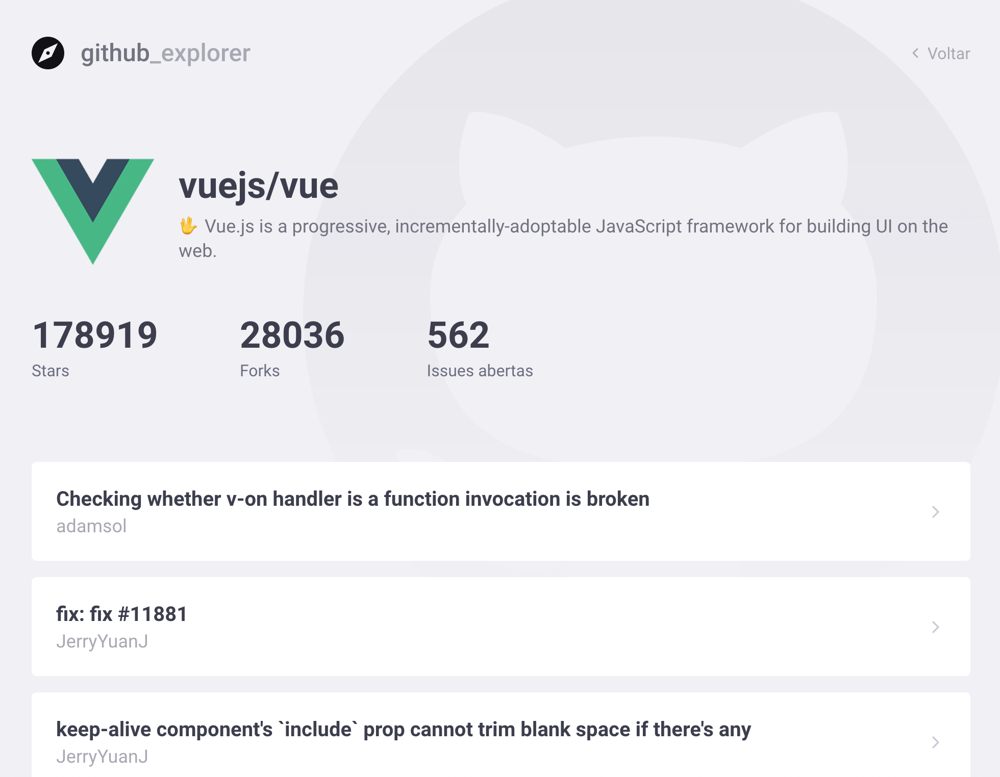

<!-- Info Header -->
<table>
  <tr>
    <td>
      
    </td>
    <td>
      <h3>
        Projeto criado no Gostack Bootcamp: React Github Explorer
      </h3>
      
Pequeno projeto criado em React, para busca de repositórios no Github.

      

        
        
      

      <p">
        <a href="#telas-do-sistema">Telas do sistema</a>&nbsp;&nbsp;&nbsp;|&nbsp;&nbsp;&nbsp;
        <a href="#descrição">Descrição</a>
      

    </td>
  </tr>
</table>

#### Telas do Sistema

    

    

---

#### Descrição

Pequena aplicação criada para busca de repositórios no Github, apenas para fixar alguns conteitos deo React e configurar o Create React App com Eslint, Path Mapping e Order Imports.
